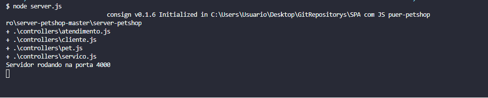

# JS na Web: Criando uma SPA com Java Script puro

### Objetivos do projeto
1. Aprender como configurar o webpack.
2. Manipular o DOM para criar um sistema de rotas.
3. Criar uma single page application utilizando Javascript puro.
4. Utilizar o sistema de módulos do Javascript para proteger os arquivos.
5. Trabalhar com componetização para facilitar a organização do projeto.

### Requisitos para rodar o projeto


## Processo para iniciar o servidor
1. Seguir até a pasta ```server-petshop-master/server-petshop/```;
2. Dentro do diretório executar o comando ```npm install``` para baixar as dependencias do servidor de aplicação;
3. Para iniciar o servidor, basta executar o comando ``` node server.js ```;
4. O servidor iniciará na porta _4000_ como mostra a imagem;



## Processo para iniciar a aplicação client
1. Seguir até a pasta raiz do projeto;
2. Dentro da pasta raiz do projeto  executar o comando ``` npm install ``` para baixar as depencias do projeto;
3. Para iniciar o servidor do Webpack que está configurado, executar o comando ``` npm start ```;
4. O servidor iniciará na porta _8080_ e estará pronto para ser usado;

#Tela inicial da aplicação 


#Etapas concluídas 
[x] Aprender como configurar o webpack.
[ ] Manipular o DOM para criar um sistema de rotas.
[ ] Criar uma single page application utilizando Javascript puro.
[ ] Utilizar o sistema de módulos do Javascript para proteger os arquivos.
[ ] Trabalhar com componetização para facilitar a organização do projeto.


#### Este projeto é baseado no curso de Java Script da Alura 
https://cursos.alura.com.br/
